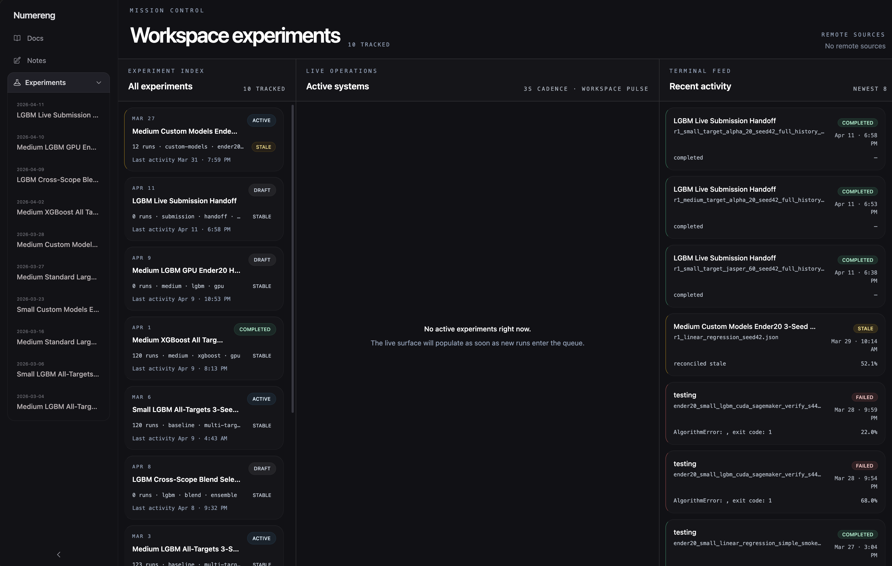

# numereng

[](https://www.python.org/downloads/)
[](LICENSE)
[](https://github.com/dshap474/numereng/actions/workflows/ci.yml)

`numereng` is a local-first workspace for Numerai model development. One repo, one CLI, and a read-only dashboard for training, experiments, ensembles, and submissions.

Built for Numerai participants who want an end-to-end local workflow for iterating on tournament models — experiment-centric, not just a CLI wrapper. `numereng` is pre-1.0 and community-built; the CLI is stable enough to build on but will continue to evolve.

## Contents

- [Features](#features)
- [How `numereng` Compares](#how-numereng-compares)
- [Prerequisites](#prerequisites)
- [Quick Start](#quick-start)
- [What You'll See](#what-youll-see)
- [I Want To…](#i-want-to)
- [Your First Model](#your-first-model)
- [Workspace Layout](#workspace-layout)
- [Python API](#python-api)
- [Docs](#docs)
- [Contributing](#contributing)
- [Project Notes](#project-notes)
- [Support, Security, License](#support-security-license)

## Features

- **Local-first workspace.** All runtime state lives under `.numereng/` in your repo. No global daemon, no cloud account required.
- **Experiment-centric.** Track configs, champions, reports, and full history under one experiment root.
- **Hyperparameter optimization.** Optuna-backed search over one config and its search space.
- **Ensembles.** Blend scored runs into one ranked prediction set.
- **Feature neutralization.** Apply feature-neutralization to any set of predictions.
- **Serving and hosted uploads.** Freeze production packages and push pickles to Numerai-hosted models.
- **Remote and cloud training.** SSH-driven remote workstations, EC2, and Modal for when local compute runs out.
- **Read-only dashboard.** `just viz` gives you a mission-control UI over the current checkout.
- **Agent-extensible.** Drop custom model wrappers into `src/numereng/features/models/custom_models/` and they are auto-discovered.

## How `numereng` Compares

- **vs. [`numerapi`](https://github.com/numerai/numerapi)** — `numereng` uses `numerapi` under the hood. It adds experiment tracking, scoring, ensembles, serving, and a dashboard.
- **vs. [`numerblox`](https://github.com/crowdcent/numerblox)** — `numerblox` is a component library. `numereng` is an end-to-end workspace with a CLI and persistent state.
- **vs. [`numerai-cli`](https://github.com/numerai/numerai-cli)** — `numerai-cli` targets compute-node deployments. `numereng` targets iterative local development with optional remote and cloud offloading.

## Prerequisites

- Python 3.12+
- [`uv`](https://docs.astral.sh/uv/) package manager
- `git`
- **Node.js 20+** — required for `just viz` (dashboard)
- **Numerai API credentials** — `NUMERAI_PUBLIC_ID` and `NUMERAI_SECRET_KEY` exported in your shell. Required for dataset, round, and submission operations. See [Installation](docs/numereng/getting-started/installation.md#configure-numerai-credentials).
- (Optional) Docker — only if building hosted Numerai pickle packages locally.

## Quick Start

Clone the repo, install deps, initialize the local store, and launch the dashboard:

```bash
git clone https://github.com/dshap474/numereng.git
cd numereng
uv sync
uv run numereng store init
just viz
```

- Dashboard UI: [http://127.0.0.1:5173](http://127.0.0.1:5173)
- Backend API: [http://127.0.0.1:8502](http://127.0.0.1:8502)

Contributors should use `uv sync --extra dev`, which adds test and lint tooling plus additional model backends. See [CONTRIBUTING.md](CONTRIBUTING.md).

## What You'll See



The dashboard is read-only: it surfaces experiments, runs, notes, and the embedded Numerai docs reader over your local workspace. See [Dashboard & Monitor](docs/numereng/workflows/dashboard.md).

## I Want To…

| Task                                       | Command                                                   |
| ------------------------------------------ | --------------------------------------------------------- |
| Train one standalone model                 | `uv run numereng run train --config <config-path>`        |
| Train inside a tracked experiment          | `uv run numereng experiment train ...`                    |
| Compare configs in one experiment          | `uv run numereng experiment report --id <experiment-id>`  |
| Hyperparameter search (Optuna)             | `uv run numereng hpo create ...`                          |
| Autonomous agent research loop             | `uv run numereng research init / run ...`                 |
| Blend runs into an ensemble                | `uv run numereng ensemble build --run-ids ...`            |
| Feature-neutralize predictions             | `uv run numereng neutralize apply ...`                    |
| Package a production model                 | `uv run numereng serve package create ...`                |
| Upload a hosted Numerai pickle             | `uv run numereng serve pickle upload ...`                 |
| Submit a round                             | `uv run numereng run submit ...`                          |
| Train on a remote machine over SSH         | `uv run numereng remote experiment launch ...`            |
| Train on EC2 / Modal                       | `uv run numereng cloud ...`                               |
| Monitor live state                         | `just viz` or `uv run numereng monitor snapshot`          |
| Sync official Numerai docs locally         | `uv run numereng docs sync numerai`                       |
| Scrape the Numerai forum                   | `uv run numereng numerai forum scrape`                    |

## Your First Model

Before you start, populate the required Numerai datasets under `.numereng/datasets/<data-version>/` — see [Numerai Operations](docs/numereng/workflows/numerai-ops.md).

Create an experiment, train one config, inspect, and submit:

```bash
uv run numereng experiment create \
  --id 2026-04-19_baseline \
  --name "Baseline" \
  --hypothesis "LGBM on v5.2 small features"

# Author .numereng/experiments/2026-04-19_baseline/configs/r1_baseline.json
# (see the full walkthrough for the config schema)

uv run numereng experiment train \
  --id 2026-04-19_baseline \
  --config .numereng/experiments/2026-04-19_baseline/configs/r1_baseline.json

uv run numereng experiment report --id 2026-04-19_baseline
uv run numereng run submit --model-name <model-name> --run-id <run-id>
```


The full walkthrough — including the config schema, scoring, and submission — is in [`docs/numereng/getting-started/first-model.md`](docs/numereng/getting-started/first-model.md).

## Workspace Layout

The repo checkout is the workspace. Runtime state is local and gitignored:

```
.numereng/
├── experiments/   # manifests, configs, reports, round-scored workflows
├── runs/          # run artifacts and scored outputs
├── datasets/      # Numerai datasets, baselines, downsampled variants
├── notes/         # research memory
├── cache/         # runtime caches (incl. pulled cloud archives)
├── tmp/           # managed scratch
├── remote_ops/    # remote orchestration state
└── numereng.db    # SQLite store index
```

Extension and authoring roots (tracked in git):

- `src/numereng/features/models/custom_models/` — drop in a custom model wrapper (auto-discovered)
- `src/numereng/features/agentic_research/programs/` — author a research program
- `.agents/skills/` — repo-local agent skills (gitignored)

## Python API

For typed automation, the stable surface lives under `numereng.api`:

```python
from numereng import api
from numereng.api.contracts import ExperimentReportRequest

report = api.experiment_report(
    ExperimentReportRequest(experiment_id="2026-04-19_baseline", limit=5)
)
```

See the [Python API reference](docs/numereng/reference/python-api.md). For full local training orchestration, use `numereng.api.pipeline`.

## Docs

- [Installation](docs/numereng/getting-started/installation.md)
- [First Model](docs/numereng/getting-started/first-model.md)
- [Project Layout](docs/numereng/getting-started/project-layout.md)
- [Dashboard & Monitor](docs/numereng/workflows/dashboard.md)
- [Custom Models](docs/numereng/reference/custom-models.md)
- [Serving & Model Uploads](docs/numereng/workflows/serving.md)
- [Architecture](docs/ARCHITECTURE.md)
- [Troubleshooting Runbooks](docs/project/runbooks/)
- [Agent Usage Guide](AGENTS.md)

To mirror the official Numerai docs locally (~500 files including images):

```bash
uv run numereng docs sync numerai
```


## Contributing

See [CONTRIBUTING.md](CONTRIBUTING.md).

## Project Notes

`numereng` is distributed as a repo-clone workspace, not a PyPI package. Runtime state stays under gitignored paths (`.numereng/`, `.env`, real remote profile YAMLs). See [Public Repo Boundary](docs/project/public-repo-boundary.md) for the full contract and retained-corpus inventory.

## Support, Security, License

- Questions and bugs: see [SUPPORT.md](SUPPORT.md) and the repo's GitHub issues.
- Security: see [SECURITY.md](SECURITY.md).
- Licensed under [MIT](LICENSE).

---

Built by [@dshap474](https://github.com/dshap474). `numereng` is community-built and is not affiliated with, endorsed by, or supported by Numerai.
