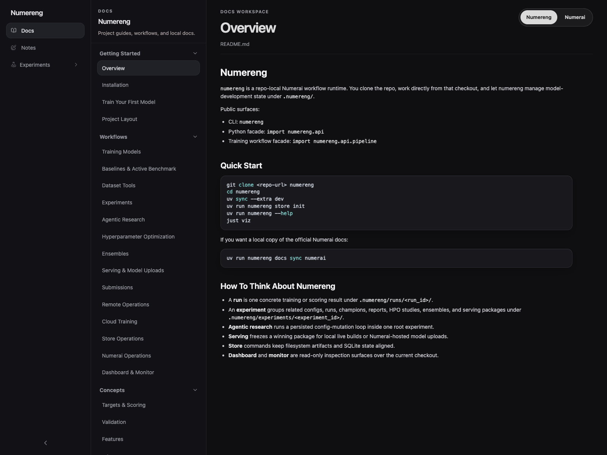
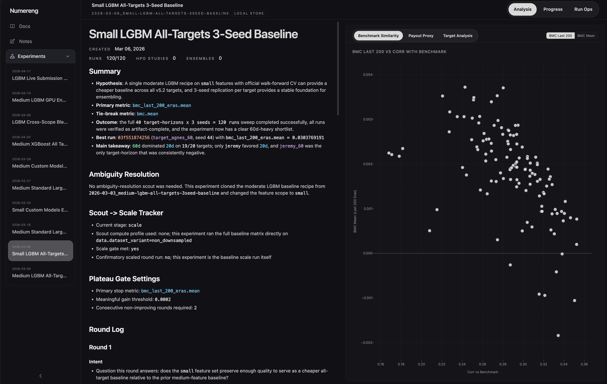
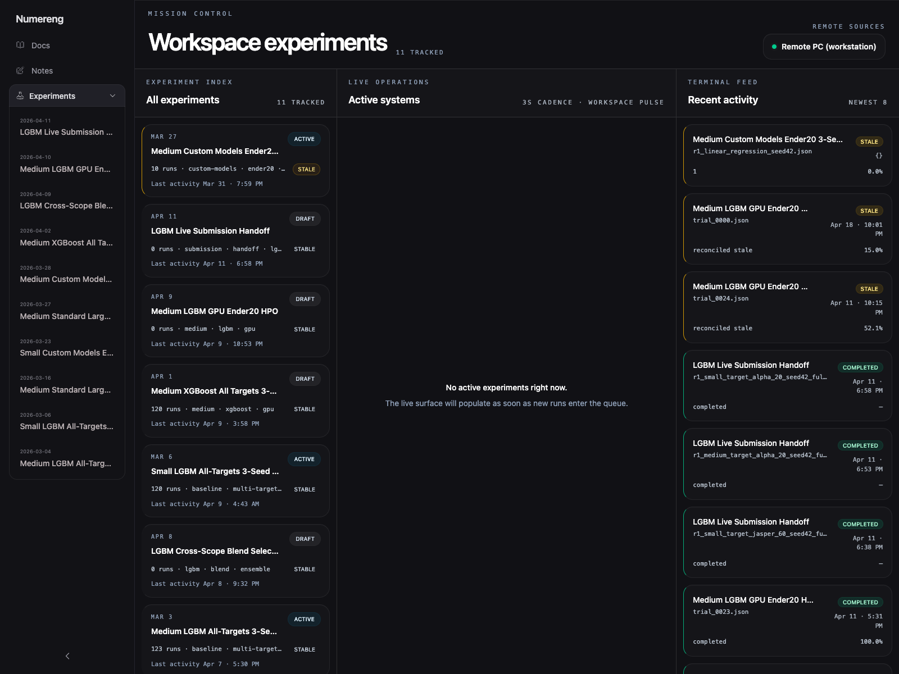

# numereng

`numereng` is a local-first Numerai workspace repo: train models, run experiments, compare configs, build ensembles, package production models, and submit — all driven from one repo checkout with one CLI and one read-only dashboard.

It is designed for Numerai users who want their experiment state, artifacts, datasets, and dashboards to live inside the project directory and be reproducible from `git clone` + `uv sync`.

`numereng` is a community-built, self-supported tool. It is not affiliated with, endorsed by, or supported by Numerai.

## Public Repo Boundary

`numereng` is currently supported as a repo-clone workspace, not as a public downloadable package. The public contract is:

- clone the repo
- run `uv sync`
- keep runtime state under local gitignored paths like `.numereng/`, `.env`, and remote profile YAMLs

See [Public Repo Boundary](docs/project/public-repo-boundary.md) for the retained-corpus inventory and [Numerai Sync Policy](docs/numerai/SYNC_POLICY.md) for the tracked docs mirror policy.

## Why numereng

- **Local-first workspace.** All runtime state lives under `.numereng/` in your repo. No global daemon, no cloud account required.
- **One CLI, one dashboard.** `numereng` drives training, scoring, submissions, serving, remote ops, and monitoring. `just viz` gives you a read-only mission-control UI.
- **Experiment-centric.** Compare configs, track champions, package winners, and keep the full history of what you tried.
- **Extensible.** Drop custom model wrappers or agentic-research programs into the repo and they are auto-discovered.

## Prerequisites

- Python `3.12+`
- [`uv`](https://docs.astral.sh/uv/) package manager
- `git`
- (optional) Docker, if you want to build hosted Numerai pickle packages locally

## Quick Start

Clone the repo, install deps, initialize the local store, and launch the dashboard:

```bash
git clone <your-fork-or-local-path> numereng
cd numereng
uv sync --extra dev
uv run numereng store init
just viz
```

- Dashboard UI: [http://127.0.0.1:5173](http://127.0.0.1:5173)
- Backend API: [http://127.0.0.1:8502](http://127.0.0.1:8502)

Pull the official Numerai docs into this checkout (optional, ~500 files including images):

```bash
uv run numereng docs sync numerai
```



## Your First Model

End-to-end — create a tracked experiment, train one config, inspect the result, submit when ready.

**1. Create an experiment**

```bash
uv run numereng experiment create \
  --id 2026-04-19_baseline \
  --name "Baseline" \
  --hypothesis "LGBM on v5.2 small features"
```

**2. Add a config** at `.numereng/experiments/2026-04-19_baseline/configs/r1_baseline.json`:

```json
{
  "data": {
    "data_version": "v5.2",
    "dataset_variant": "non_downsampled",
    "feature_set": "small",
    "target_col": "target"
  },
  "model": {
    "type": "LGBMRegressor",
    "params": { "n_estimators": 2000, "learning_rate": 0.01, "num_leaves": 64 }
  },
  "training": {
    "engine": { "profile": "purged_walk_forward" },
    "post_training_scoring": "core"
  }
}
```

**3. Train it**

```bash
uv run numereng experiment train \
  --id 2026-04-19_baseline \
  --config .numereng/experiments/2026-04-19_baseline/configs/r1_baseline.json
```

**4. Inspect**

```bash
uv run numereng experiment report --id 2026-04-19_baseline
uv run numereng experiment details --id 2026-04-19_baseline
```

**5. Submit**

```bash
uv run numereng run submit --model-name MY_MODEL --run-id <run_id>
```

See [`docs/numereng/getting-started/first-model.md`](docs/numereng/getting-started/first-model.md) for the full walkthrough.



## I Want To…

| Task                                       | Command                                          |
| ------------------------------------------ | ------------------------------------------------ |
| Train one standalone model                 | `uv run numereng run train --config <path>`      |
| Train inside a tracked experiment          | `uv run numereng experiment train ...`           |
| Compare configs in one experiment          | `uv run numereng experiment report --id <id>`    |
| Hyperparameter search (Optuna)             | `uv run numereng hpo create ...`                 |
| Autonomous agent research loop             | `uv run numereng research init / run ...`        |
| Blend runs into an ensemble                | `uv run numereng ensemble build --run-ids ...`   |
| Feature-neutralize predictions             | `uv run numereng neutralize apply ...`           |
| Package a production model                 | `uv run numereng serve package create ...`       |
| Upload a hosted Numerai pickle             | `uv run numereng serve pickle upload ...`        |
| Submit a round                             | `uv run numereng run submit ...`                 |
| Train on a remote machine over SSH         | `uv run numereng remote experiment launch ...`   |
| Train on EC2 / Modal                       | `uv run numereng cloud ...`                      |
| Monitor live state                         | `just viz` or `uv run numereng monitor snapshot` |
| Sync official Numerai docs locally         | `uv run numereng docs sync numerai`              |
| Scrape the Numerai forum                   | `uv run numereng numerai forum scrape`           |



## Workspace Layout

The repo checkout is the workspace. Runtime state is local and gitignored:

```
.numereng/
├── experiments/   # manifests, configs, reports, round-scored workflows
├── runs/          # run artifacts and scored outputs
├── datasets/      # Numerai datasets, baselines, downsampled variants
├── notes/         # research memory
├── cache/         # runtime caches (incl. pulled cloud archives)
├── tmp/           # managed scratch
├── remote_ops/    # remote orchestration state
└── numereng.db    # SQLite store index
```

Extension and authoring roots (tracked in git):

- `src/numereng/features/models/custom_models/` — drop in a custom model wrapper (auto-discovered)
- `src/numereng/features/agentic_research/programs/` — author a research program
- `.agents/skills/` — repo-local agent skills (gitignored)

## Python API

For typed automation, the stable surface lives under `numereng.api`:

```python
from numereng import api
from numereng.api.contracts import ExperimentListRequest, ExperimentReportRequest

listing = api.experiment_list(ExperimentListRequest())
report = api.experiment_report(
    ExperimentReportRequest(experiment_id="2026-04-19_baseline", limit=5)
)
```

For full local training orchestration, use `numereng.api.pipeline`.

## Docs

- [Installation](docs/numereng/getting-started/installation.md)
- [First Model](docs/numereng/getting-started/first-model.md)
- [Project Layout](docs/numereng/getting-started/project-layout.md)
- [Dashboard](docs/numereng/workflows/dashboard.md)
- [Custom Models](docs/numereng/reference/custom-models.md)
- [Serving & Model Uploads](docs/numereng/workflows/serving.md)
- [Architecture](docs/ARCHITECTURE.md)
- [Public Repo Boundary](docs/project/public-repo-boundary.md)
- [Agent Usage Guide](AGENTS.md)

## Contributing

```bash
uv sync --extra dev
just oss-preflight
just readiness
just test
```

See [CONTRIBUTING.md](CONTRIBUTING.md) and [docs/ARCHITECTURE.md](docs/ARCHITECTURE.md).

## Community & Support

- Issues and feature requests: GitHub issues on this repo
- Discussion and tips: GitHub discussions
- This is a community-built tool. It is not affiliated with, endorsed by, or supported by Numerai.
