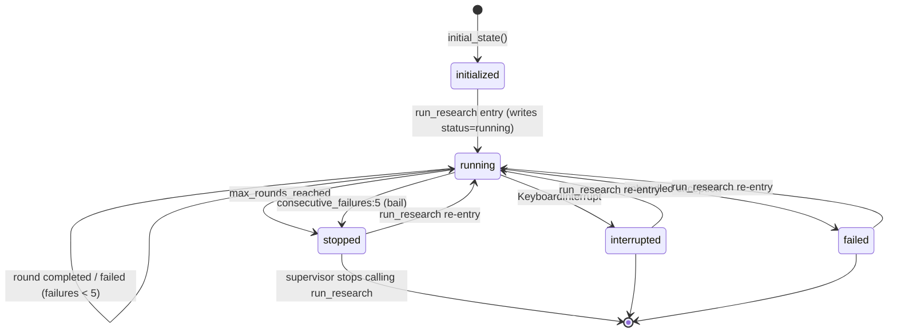
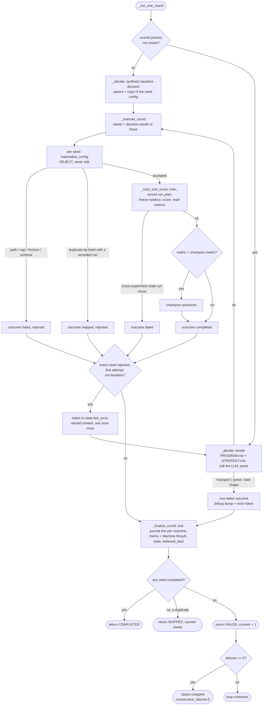

# Agentic Research State Diagram

The state machine after the 7-invariants rebuild. The harness is deliberately small: the LLM
proposes one `decision_form` per round; the harness validates, executes, and records it. There is
no phase machine, no confirmation accounting, and no diversification enforcement — those moved into
`PROGRAM.md` and the experiment's `STRATEGY.md` brief.

Two machines remain:

1. **Session lifecycle** — the `status` field on `state.json`.
2. **Per-round outcome** — what one `_run_one_round` call resolves to.

## 1. Session Lifecycle

`status` on `state.json`, written by `run_research`, the round driver, and the failure path.

Notes:

- **No status is permanently terminal across invocations.** `run_research` writes `status="running"`
  before the loop starts, so `stopped`/`interrupted`/`failed` are all reset on re-entry. Only the
  supervisor's decision to stop calling `run_research` actually ends the run.
- The **bail** is resumable: 5 consecutive failed rounds sets `status=stopped` with
  `stop_reason="consecutive_failures:5"`; the next `run_research` call resumes. The
  `failed_rounds_counter` resets on any successful (completed or skipped) round.
- `stop_reason`, `last_checkpoint`, `last_error`, and `last_heartbeat` persist across invocations for
  forensics. **`last_heartbeat`** is written every round so `get_research_status` can surface a
  stale-but-`running` session instead of reading dead-`running` forever (the remote-reboot blind
  spot).

## 2. Per-Round Outcome

One call to `_run_one_round`, which is three steps: `_decide` produces one proposal, `_execute_round`
materializes and trains one config per requested seed, and `_finalize_round` records the round. The
first round with no scored primary row takes the baseline decision (a copy of the seed config, no
LLM call) and otherwise records like any other round.

## 3. Round Outcomes And Invariants

One decision is one round. `_execute_round` builds one outcome per seed, `_entry_from_outcome`
shapes each into a journal line, and `_finalize_round` — the only journal-write site — appends them
all, writes the memo, and updates state. The round's own status comes from the outcomes, and the
primary outcome (the best completed seed, else the last) is what the memo, the state, and the
returned result speak for.

- **completed** — at least one seed trained and scored. The champion advances per completed run iff
  `metric > champion.metric` (one mechanical comparison, no margin). Resets `failed_rounds_counter`.
- **failed** — no seed completed and none was a duplicate: an LLM transport failure, a bad response
  shape, a non-`run` action, a boundary rejection (disallowed path, out-of-cap value, horizon/target
  mismatch, invalid TrainingConfig, cross-experiment stale-run reuse), or a training or scoring
  failure. Increments `failed_rounds_counter`; bails at 5.
- **skipped** — no seed completed and at least one was a duplicate-by-hash soft skip. Resets
  `failed_rounds_counter` and does **not** count toward the bail.

Key guards:

- **Boundary-only rejection.** The harness never edits a proposed config; out-of-bounds proposals are
  rejected whole, never clamped or normalized.
- **One retry per round.** When the boundary refuses every seed on the first attempt of a non-baseline
  round — a rejection or a duplicate — the token goes back as `state.last_error`, the context is
  rebuilt, and the model is asked once more. A second failure is recorded and counted exactly as a
  single failure was. A partial seed failure is not a refused round and never retries. The first
  token appears in the memo's `## Machine Result` block as `retry: <token>`.
- **Dedup vs. orphan.** A config hash that already has a recorded run in the journal is a true
  duplicate → soft skip. A config hash with no recorded run is a crash orphan → written under this
  round's filename and run (so a mid-round crash does not poison the hash and dead-end the search).
- **Stale-run-reuse guard.** Linking a FINISHED run to the experiment on a hash collision is allowed
  within the same experiment; a cross-experiment reuse hard-fails
  (`agentic_research_stale_run_reuse_blocked:`).
- **Scored-or-failed rule.** A round that links a FINISHED run must end with that run scored. A reused
  run with no primary metric on disk is rescored; never "complete" a round with an unscored run.

## 4. Artifacts Written

| Path | Writer | Trigger |
| --- | --- | --- |
| `agentic_research/state.json` (schema_version 2) | `save_state` | each round |
| `agentic_research/journal.jsonl` | `_finalize_round` | one line per seed outcome, at least one per round attempt (append-only) |
| `agentic_research/rounds/rN.md` | `_finalize_round` | each round: model memo verbatim + machine block, with `retry:` and per-seed lines when present |
| `agentic_research/rounds/rN.debug.*` | failure debug dump | LLM transport/parse failures only |
| `EXPERIMENT.md` | passthrough write | each round the model returns non-null `experiment_markdown` |
| `configs/config_NNN.json` | `materialize_config` (`baseline_config` on the baseline round) | each accepted seed; `config_NNN_s<seed>.json` in a multi-seed round |
| `run_plan.csv` | run-plan recorder | each round that trains a run |

## 5. state.json (v2)

`schema_version: 2`; an older state loads via `apply_state_defaults` (missing keys are defaulted;
`champion` defaults to `null` and is rebuilt by subsequent rounds' mechanical advancement;
`best_overall` derives from the experiment report). Keys: `experiment_id`, `status`,
`next_round_number`, `total_rounds_completed`,
`failed_rounds_counter`, `stop_reason`, `champion {config, run_id, metric, round} | null`,
`believed_best`, `believed_best_changed_round`,
`best_overall` (public-typed view derived from the report), `last_round_label`, `last_run_id`,
`last_checkpoint`, `last_error`, `last_heartbeat`, `created_at`, `updated_at`.
