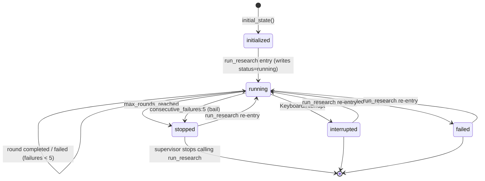
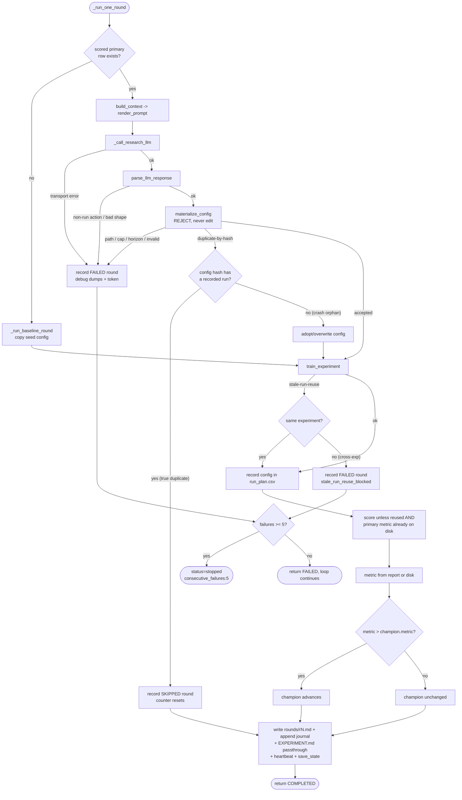

# Agentic Research State Diagram

The state machine after the 7-invariants rebuild. The harness is deliberately small: the LLM
proposes one `decision_form` per round; the harness validates, executes, and records it. There is
no phase machine, no confirmation accounting, and no diversification enforcement — those moved into
`PROGRAM.md`.

Two machines remain:

1. **Session lifecycle** — the `status` field on `state.json`.
2. **Per-round outcome** — what one `_run_one_round` call resolves to.

## 1. Session Lifecycle

`status` on `state.json`, written by `run_research`, the round driver, and the failure path.

Notes:

- **No status is permanently terminal across invocations.** `run_research` writes `status="running"`
  before the loop starts, so `stopped`/`interrupted`/`failed` are all reset on re-entry. Only the
  supervisor's decision to stop calling `run_research` actually ends the run.
- The **bail** is resumable: 5 consecutive failed rounds sets `status=stopped` with
  `stop_reason="consecutive_failures:5"`; the next `run_research` call resumes. The
  `failed_rounds_counter` resets on any successful (completed or skipped) round.
- `stop_reason`, `last_checkpoint`, `last_error`, and `last_heartbeat` persist across invocations for
  forensics. **`last_heartbeat`** is written every round so `get_research_status` can surface a
  stale-but-`running` session instead of reading dead-`running` forever (the remote-reboot blind
  spot).

## 2. Per-Round Outcome

One call to `_run_one_round`. The first round with no scored primary row takes the **baseline**
branch (copy the seed config, train, score). Every later round goes through the LLM.

## 3. Round Outcomes And Invariants

Round outcome ∈ `completed | failed | skipped`, recorded as one append-only line in `journal.jsonl`
and one `rounds/rN.md` memo.

- **completed** — config trained and scored; champion advances iff `metric > champion.metric` (one
  mechanical comparison, no margin). Resets `failed_rounds_counter`.
- **failed** — LLM transport failure, bad response shape, non-`run` action, or a boundary rejection
  (disallowed path, out-of-cap value, horizon/target mismatch, invalid TrainingConfig, cross-
  experiment stale-run reuse). Increments `failed_rounds_counter`; bails at 5.
- **skipped** — duplicate-by-hash with a recorded run (soft skip). Resets `failed_rounds_counter`
  and does **not** count toward the bail.

Key guards:

- **Boundary-only rejection.** The harness never edits a proposed config; out-of-bounds proposals are
  rejected whole, never clamped or normalized.
- **Dedup vs. orphan.** A config hash that already has a recorded run in the journal is a true
  duplicate → soft skip. A config hash with no recorded run is a crash orphan → adopt/overwrite and
  run (so a mid-round crash does not poison the hash and dead-end the search).
- **Stale-run-reuse guard.** Linking a FINISHED run to the experiment on a hash collision is allowed
  within the same experiment; a cross-experiment reuse hard-fails
  (`agentic_research_stale_run_reuse_blocked:`).
- **Scored-or-failed rule.** A round that links a FINISHED run must end with that run scored. A reused
  run with no primary metric on disk is rescored; never "complete" a round with an unscored run.

## 4. Artifacts Written

| Path | Writer | Trigger |
| --- | --- | --- |
| `agentic_research/state.json` (schema_version 2) | `save_state` | each round |
| `agentic_research/journal.jsonl` | journal append | one line per round attempt (append-only) |
| `agentic_research/rounds/rN.md` | round memo writer | each round (model memo verbatim + machine block) |
| `agentic_research/rounds/rN.debug.*` | failure debug dump | LLM transport/parse failures only |
| `EXPERIMENT.md` | passthrough write | each round the model returns non-null `experiment_markdown` |
| `configs/config_NNN.json` | `materialize_config` | each accepted `run` / baseline round |
| `run_plan.csv` | run-plan recorder | each round that trains a run |

## 5. state.json (v2)

`schema_version: 2`; an older state loads via `apply_state_defaults` (missing keys are defaulted;
`champion` defaults to `null` and is rebuilt by subsequent rounds' mechanical advancement;
`best_overall` derives from the experiment report). Keys: `experiment_id`, `status`,
`next_round_number`, `total_rounds_completed`,
`failed_rounds_counter`, `stop_reason`, `champion {config, run_id, metric, round} | null`,
`best_overall` (public-typed view derived from the report), `last_round_label`, `last_run_id`,
`last_checkpoint`, `last_error`, `last_heartbeat`, `created_at`, `updated_at`.
