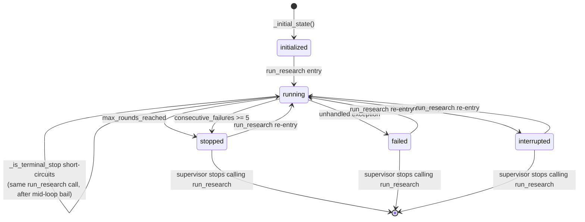
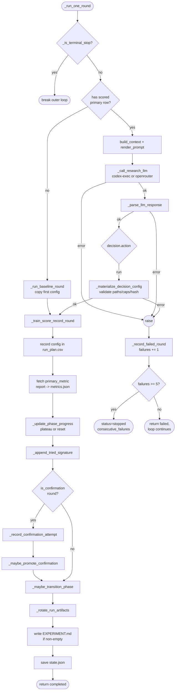
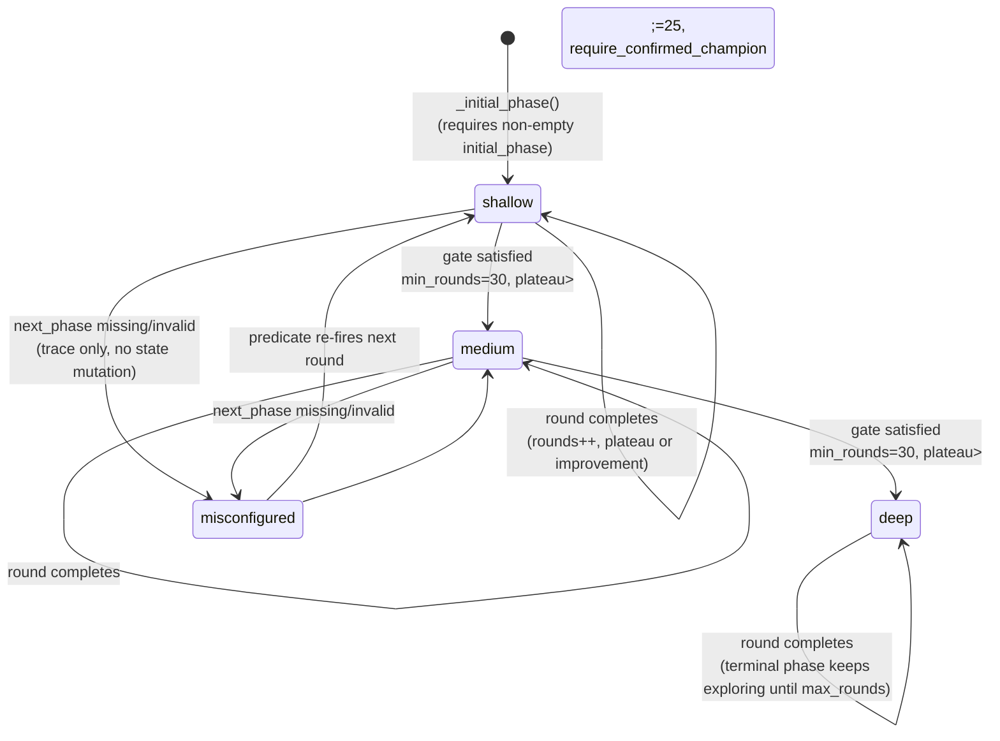

# Agentic Research State Diagram

A visual map of the state machines inside `run.py`. There are four loosely-coupled
machines, each governed by Python (the LLM only proposes one `decision_form` per
round — Python decides what changes state).

1. **Loop lifecycle** — the `status` field on `state.json` (`initialized → running → stopped/failed/interrupted`).
2. **Per-round dispatch** — what one `_run_one_round` call does (baseline vs. run, failure handling).
3. **Phase machine** — `shallow → medium → deep`, gated by `min_rounds`, `plateau`, and an optional confirmed champion.
4. **Confirmation machine** — per `parent_config`: collect the canonical seed trio `(42, 17, 99)`, then maybe promote to `confirmed_champion`.

## 1. Loop Lifecycle

`status` on `state.json`. Set by `run_research`, `_train_score_record_round`,
`_record_failed_round`, and `_maybe_transition_phase`.



Notes:

- **No status is permanently terminal across invocations.** `run_research`
  unconditionally writes `status="running"` at lines 226-229 before the loop
  starts. `stopped`, `failed`, and `interrupted` are all reset to `running` the
  moment `run_research` is called again. Only the supervisor's decision to stop
  invoking `run_research` actually ends the loop.
- `_is_terminal_stop` matters **only within a single `run_research` call**: if a
  round mid-loop flips `status` to `stopped` (max_rounds or consecutive-failure
  bail), the next iteration's check breaks the loop. On a fresh invocation, the
  unconditional reset happens before this check ever fires.
- `stop_reason` and `last_checkpoint` persist across invocations for forensics
  even though `status` does not.

## 2. Per-Round Dispatch

One call to `_run_one_round`. The action taken depends on whether a baseline
scored row exists and what the LLM decides.



Key invariants encoded by ordering:

- `_record_round_config_in_run_plan` and `_write_experiment_markdown` only run
  **after** `train_experiment` and `score_experiment_round` succeed. A failed
  round never pollutes the run plan or the curated working memory.
- `_record_failed_round` writes a markdown stub and increments
  `failed_rounds_counter`; it does **not** advance phase counters.

## 3. Phase Machine

Driven by `_maybe_transition_phase`. The phases come from
`experiment.metadata.agentic_research_phases`. The diagram below uses the
`multiphase-autonomous-v1` config (shallow → medium → deep), but the machine
itself is data-driven.



Gate (`_maybe_transition_phase`):

| Condition | Source |
| --- | --- |
| `phase_successful_rounds >= min_rounds_in_phase` | counted only on rounds with a numeric metric |
| `phase_plateau_counter >= plateau_threshold` | incremented when metric does not beat `phase_best_metric + 3e-4` |
| `phase_has_confirmed_champion(phase)` | only if `require_confirmed_champion=true` |
| `next_phase` exists in `phases_config` | validated **before** mutating state |

On transition:

- Append a `phase_history` record (`phase`, `started_round`, `ended_round`,
  `exit_reason`, `best_metric`, `successful_rounds`, `best_run_id`).
- Reset `phase_best_metric`, `phase_plateau_counter`, `phase_successful_rounds`.
- Set `phase` to `next_phase` and `phase_round_start = round_number + 1`.

## 4. Confirmation Machine

Per `parent_config` (a previously-LLM-generated `config_NNN.json`, never the
baseline `config_001.json`). Driven by `_record_confirmation_attempt` and
`_maybe_promote_confirmation`.

```mermaid
stateDiagram-v2
    [*] --> empty
    empty --> partial: seed 42 (or 17 or 99) recorded
    partial --> partial: another canonical seed recorded
    partial --> trio_complete: all of {42, 17, 99} recorded

    trio_complete --> promoted: prior_mean is None<br/>(first-ever confirmed champion)
    trio_complete --> promoted: mean &gt; prior_mean + 3e-4
    trio_complete --> shelved: prior_mean exists<br/>and mean &lt;= prior_mean + 3e-4

    promoted --> [*]: state.confirmed_champion updated<br/>entry.promoted_at_round set
    shelved --> [*]: entry.seed_trio_primary_mean recorded<br/>(no champion change)
```

`_is_confirmation_round` requires **all** of:

- `decision.action == "run"`
- exactly one change with `path == "model.params.random_state"`
- `parent_config` matches `config_NNN.json` and is **not** `config_001.json`
- the seed value is an `int` (booleans rejected)

A challenger becomes a confirmation candidate when its single seed beats the
champion's **trio mean** (`seed_trio_primary_mean`), and promotes when its own
trio mean clears the champion's trio mean by `CONFIRMATION_PROMOTION_MARGIN =
1.5e-4` (the trio-mean standard error; the `3e-4` single-seed noise floor is the
wrong scale for a 3-seed mean — see ADR 2026-05-31). A confirmed champion in a
phase satisfies `require_confirmed_champion` for that phase's transition gate.

## 5. Cross-Machine Interactions

```mermaid
flowchart LR
    Round[Round completes successfully] --> Metric{numeric<br/>metric?}
    Metric -- no --> SkipPhase[skip phase counters]
    Metric -- yes --> PhaseProg[phase_successful_rounds++<br/>plateau or improvement]

    Round --> ConfCheck{confirmation<br/>round?}
    ConfCheck -- yes --> ConfRecord[confirmations[parent].seeds++]
    ConfRecord --> TrioCheck{trio<br/>complete?}
    TrioCheck -- yes --> MaybePromo[maybe promote champion]

    PhaseProg --> GateCheck{gate<br/>satisfied?}
    MaybePromo --> GateCheck
    GateCheck -- yes --> Transition[phase change]
    GateCheck -- no --> Continue[next round]

    Round --> Rotate{rotation<br/>mode?}
    Rotate -- disabled --> Continue
    Rotate -- dry_run --> TraceTargets[trace targets, no delete]
    Rotate -- enabled --> Unlink[delete heavy artifacts<br/>from non-essential runs]
```

Essential run IDs (never rotated):

- every row in the truncated `ExperimentReport`,
- every `runs.*.run_id` across all `confirmations` entries,
- every `best_run_id` in `phase_history`,
- every run in `confirmed_champion.runs`,
- every `tried_signatures` entry within the last
  `ARTIFACT_ROTATION_RECENT_ROUND_GRACE = 10` rounds.

Defense-in-depth scope: rotation only considers run directories whose name
appears in `experiment.runs ∪ essential ∪ _state_run_ids(state)`. Sibling
experiments sharing the `runs/` root are never touched.

## 6. Persistent State Fields (`state.json`)

| Field | Owner | Reset on |
| --- | --- | --- |
| `status` | loop lifecycle | new `run_research` invocation |
| `next_round_number` | round dispatch | never |
| `total_rounds_completed` | round dispatch | never |
| `failed_rounds_counter` | failure handling | any successful round |
| `last_checkpoint`, `last_round_label`, `last_run_id` | round dispatch | each round |
| `phase` | phase machine | phase transition |
| `phase_round_start` | phase machine | phase transition |
| `phase_best_metric` | phase machine | phase transition |
| `phase_plateau_counter` | phase machine | phase transition or improvement |
| `phase_successful_rounds` | phase machine | phase transition |
| `phase_history` | phase machine | append-only |
| `phase_cost_totals` | phase machine | append-only (per-phase) |
| `confirmations` | confirmation machine | append-only per `parent_config` |
| `confirmed_champion` | confirmation machine | overwritten on promotion |
| `tried_signatures` | LLM context | rolling window (last 100) |
| `best_overall` | round dispatch | each round (snapshot of leaderboard #1) |

## 7. External Artifacts Written

| Path | Writer | Trigger |
| --- | --- | --- |
| `agentic_research/state.json` | `_save_state` | each round |
| `agentic_research/trace.jsonl` | `_append_trace` | each event |
| `agentic_research/rounds/decision.json` | `_append_decision_log` | each round |
| `agentic_research/rounds/rNNN.md` | `_write_llm_round_markdown` / `_write_round_notes` / `_write_failure_round_markdown` | each round |
| `EXPERIMENT.md` | `_write_experiment_markdown` | each round if LLM returned non-empty `experiment_markdown` |
| `configs/config_NNN.json` | `_materialize_decision_config` | each `run` round |
| `run_plan.csv` | `_record_round_config_in_run_plan` | each successful `run` / baseline round |
